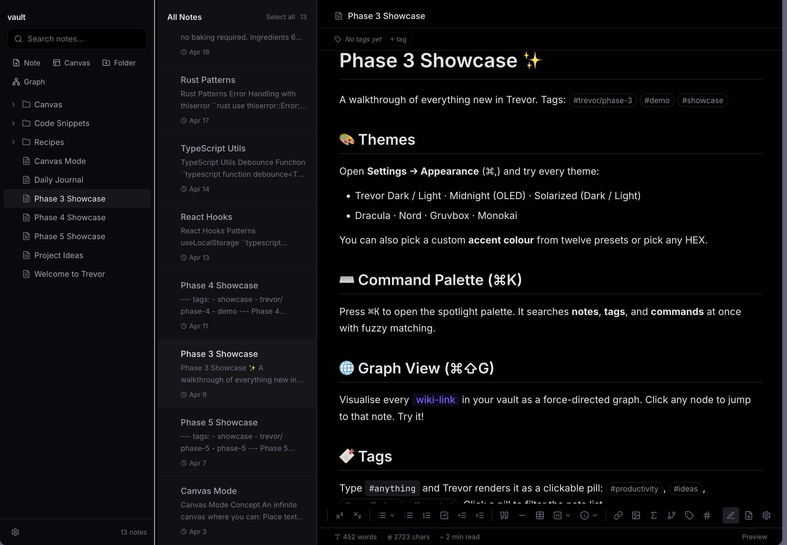
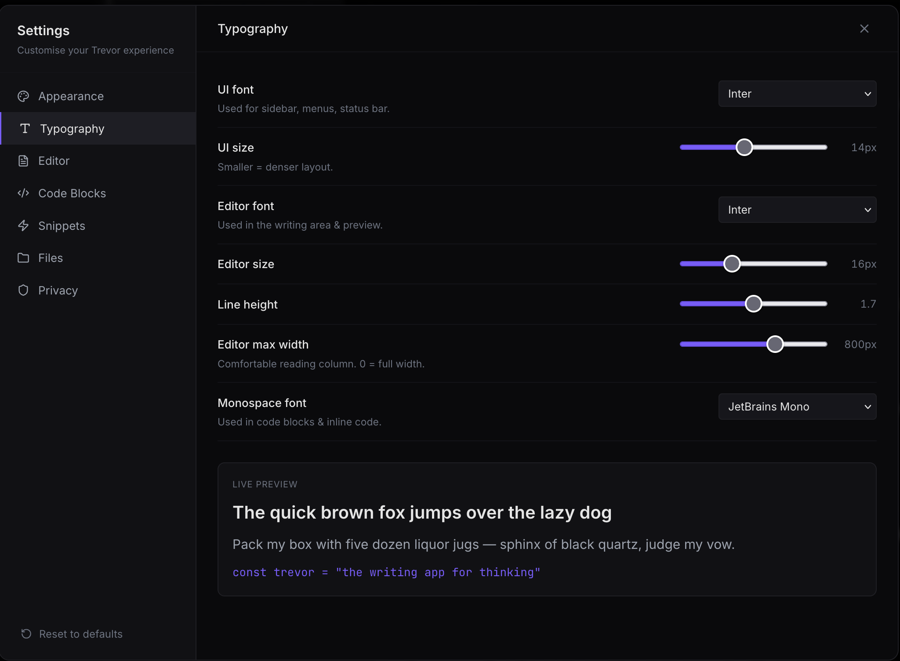

<div align="center">


# Trevor

**A local-first, keyboard-driven markdown notebook.**
Your notes are plain `.md` files on your disk. No accounts. No telemetry. No vendor lock-in.

[](https://github.com/VidhyadharanSS/Trevor/releases)
[](https://github.com/VidhyadharanSS/Trevor/actions)
[](LICENSE)
[](#download)

[Download](#download) ·
[Features](#features) ·
[Documentation](docs/USER_GUIDE.md) ·
[Shortcuts](docs/SHORTCUTS.md) ·
[Settings](docs/SETTINGS.md)

</div>

---

<div align="center">
  
</div>

---

## What is Trevor

Trevor is a desktop notebook for people who write a lot of markdown. It treats your notes the way text editors treat source code: a folder of plain files, opened with a fast editor, navigated by keyboard, and indexed by full-text search.

Everything lives on your filesystem. You can hand the same folder to Obsidian, VS Code, `git`, or `grep` and it just works. Trevor never uploads anything anywhere.

<div align="center">
  
</div>

---

## Features

<table>
<tr>
<td valign="top" width="50%">

### <picture></picture>&nbsp; Vault-based workspace

- Open any folder as a vault
- Nested folders, drag-and-drop reordering
- Multi-select with Cmd/Ctrl + click
- File-system watcher reflects external edits live

### <picture></picture>&nbsp; Markdown editor

- CodeMirror 6 with syntax highlighting
- GitHub-flavoured markdown preview
- Math (`$...$`), Mermaid diagrams, callouts
- Wiki links: `[[note name]]`, `[[note#heading]]`
- Auto-completion for tags and links
- Live word / character count

### <picture></picture>&nbsp; Search that finds everything

- Cmd/Ctrl + K opens the command palette
- Fuzzy match on titles, tags, commands
- Full-text search across note bodies
- Highlighted snippets, jump straight to the line
- Regex find-in-note (Cmd/Ctrl + F)

### <picture></picture>&nbsp; Keyboard-first

- Every action has a shortcut
- Cmd/Ctrl + N · new note
- Cmd/Ctrl + S · save (autosave optional)
- Cmd/Ctrl + [ · back, Cmd/Ctrl + ] · forward
- Cmd/Ctrl + / · shortcut reference

</td>
<td valign="top" width="50%">

### <picture></picture>&nbsp; Graph & links

- Backlinks panel for every note
- Force-directed graph view of your vault
- Wiki-link auto-complete

### <picture></picture>&nbsp; Tags & frontmatter

- `#inline` tags or YAML `tags: [...]`
- Tag browser in the sidebar
- Pin notes for quick access

### <picture></picture>&nbsp; Export & import

- Export single note as PDF, HTML, or Markdown
- Export the whole vault as a portable bundle
- Re-import a bundle on another machine
- Native save dialog on every platform

### <picture></picture>&nbsp; Customise everything

- Light, dark, and dim themes
- Accent colour, font family, font size, line height
- Editor toolbar on top or bottom
- Show/hide line numbers, invisibles, status bar
- Default note folder, attachments folder
- Autosave on/off and delay

### <picture></picture>&nbsp; Safe by design

- Atomic save mutex per file (no corrupted writes)
- External-change detection with reload prompt
- Soft-delete trash, browse and restore
- `beforeunload` guard for unsaved buffers

</td>
</tr>
</table>

---

## Download

Pre-built installers are attached to every [GitHub Release](https://github.com/VidhyadharanSS/Trevor/releases).

| Platform | File | Notes |
| --- | --- | --- |
| Linux x86_64 | `Trevor_*_amd64.AppImage` | Portable, no installer needed |
| Linux x86_64 | `trevor_*_amd64.deb` | Debian / Ubuntu |
| Linux arm64 | `Trevor_*_aarch64.AppImage` | Raspberry Pi 4/5, ARM laptops |
| Linux arm64 | `trevor_*_arm64.deb` | Debian / Ubuntu on ARM |
| macOS | `Trevor_*_universal.dmg` | Apple Silicon and Intel |
| Windows | `Trevor_*_x64_en-US.msi` | 64-bit installer |

### Linux (AppImage)

```bash
chmod +x Trevor_*.AppImage
./Trevor_*.AppImage
```

To integrate with your launcher, drop the AppImage into `~/Applications/` and use [AppImageLauncher](https://github.com/TheAssassin/AppImageLauncher) (optional).

### Linux (deb)

```bash
sudo dpkg -i trevor_*_amd64.deb
sudo apt-get install -f   # resolve missing webkit2gtk dependency on first install
```

### macOS

Open the `.dmg`, drag **Trevor** to `Applications`. On first launch, right-click the app and choose **Open** to bypass the unsigned-developer warning.

### Windows

Run the `.msi` and follow the installer. Trevor appears in the Start menu.

---

## Build from source

You'll need:

- [Node.js 20+](https://nodejs.org/)
- [Rust stable](https://rustup.rs/)
- Platform-specific [Tauri prerequisites](https://tauri.app/start/prerequisites/)

```bash
git clone https://github.com/VidhyadharanSS/Trevor.git
cd Trevor
npm install

# Run the desktop app in development mode
npm run tauri dev

# Produce a distributable bundle for your current platform
npm run tauri build
```

The built artefacts land in `src-tauri/target/release/bundle/`.

### Run the web preview only

```bash
npm run dev          # Vite dev server on http://localhost:5173
npm run build        # Production frontend bundle into ./dist
```

The web build runs Trevor on a synthetic in-memory filesystem — useful for trying the UI without installing Rust.

---

## Documentation

- **[User Guide](docs/USER_GUIDE.md)** — getting started, vaults, editing, search, export
- **[Keyboard Shortcuts](docs/SHORTCUTS.md)** — every key combination, organised by topic
- **[Settings Reference](docs/SETTINGS.md)** — what every setting does and where it's stored
- **[Contributing](CONTRIBUTING.md)** — how to file issues and submit pull requests

---

## Architecture

Trevor is built as:

| Layer | Stack |
| --- | --- |
| Shell | [Tauri 2](https://tauri.app/) (Rust) |
| UI | React 18 + TypeScript + Vite |
| Editor | [CodeMirror 6](https://codemirror.net/) |
| State | [Zustand](https://github.com/pmndrs/zustand) |
| Search | [Fuse.js](https://www.fusejs.io/) + custom snippet ranker |
| Graph | [D3](https://d3js.org/) + [React Flow](https://reactflow.dev/) |
| Diagrams | [Mermaid](https://mermaid.js.org/) |

Frontend code lives in `src/`. The Rust shell, FS watcher, and platform integrations live in `src-tauri/`.

---

## Privacy

Trevor performs zero network requests during normal use. It does not phone home, ship telemetry, fetch updates, or load remote fonts. Everything you see is rendered from local files, except for the Mermaid diagrams CDN that loads on first preview (this can be disabled in settings).

---

## License

[MIT](LICENSE) — do whatever you want, no warranty.

---

<div align="center">
  <sub>Built with care for people who like their tools fast, local, and theirs.</sub>
</div>
