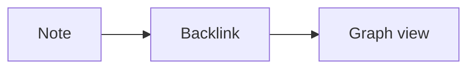

# Trevor User Guide

A complete walkthrough of every feature in Trevor, written for first-time users.

> **Tip:** the platform-correct modifier key is shown as **Mod** below. Read this as **Cmd** on macOS and **Ctrl** on Linux/Windows.

---

## Table of contents

1. [Getting started](#1-getting-started)
2. [Vaults](#2-vaults)
3. [The interface](#3-the-interface)
4. [Creating and organising notes](#4-creating-and-organising-notes)
5. [Writing markdown](#5-writing-markdown)
6. [Wiki links and backlinks](#6-wiki-links-and-backlinks)
7. [Tags and frontmatter](#7-tags-and-frontmatter)
8. [Search](#8-search)
9. [The graph view](#9-the-graph-view)
10. [Pins, history, and trash](#10-pins-history-and-trash)
11. [Export and import](#11-export-and-import)
12. [Settings and customisation](#12-settings-and-customisation)
13. [Daily notes](#13-daily-notes)
14. [Snippets](#14-snippets)
15. [Tips and tricks](#15-tips-and-tricks)
16. [Troubleshooting](#16-troubleshooting)

---

## 1. Getting started

After installing Trevor, launch it from your Applications menu (macOS), Start menu (Windows), or `./Trevor.AppImage` (Linux).

The first screen asks you to **Open a vault**. A vault is just a folder on your disk. Pick any folder you want — empty or full of existing markdown files — and Trevor will adopt it.

You can switch vaults later from the title bar.

---

## 2. Vaults

Trevor never moves your files. Whatever you save inside a vault is a real `.md` file at that path on your disk. You can:

- Edit notes in another editor while Trevor is running — Trevor's filesystem watcher will pick up the change and offer to reload.
- Put the vault folder under `git` for version control.
- Drop attachments into a sub-folder; Trevor will surface them as long as they're inside the vault.
- Move the vault folder to a new machine — Trevor on the new machine will open it as-is.

The path of your last opened vault is remembered. The next launch goes straight there.

---

## 3. The interface

```
┌────────────────────────────────────────────────────────────────────────┐
│  Title bar    │  current note path           │  command palette │ ⋯   │
├────────┬──────┴──────────────────────────────┴──────────────────┬─────┤
│        │                                                        │     │
│ Side   │              Editor / Preview                          │ Out │
│ bar    │                                                        │ line│
│        │                                                        │     │
│        ├────────────────────────────────────────────────────────┤     │
│        │              Status bar                                │     │
└────────┴────────────────────────────────────────────────────────┴─────┘
```

**Sidebar (left)** — vault tree, search results, tag browser, pinned notes. Toggle with **Mod + B**.

**Editor (centre)** — CodeMirror by default. Switch to live preview or split view from the editor toolbar.

**Outline / Backlinks (right)** — table of contents for the current note plus links pointing to it. Toggle with **Mod + Shift + B**.

**Status bar (bottom)** — word count, character count, save state, current line/column.

---

## 4. Creating and organising notes

| Action | How |
| --- | --- |
| New note in current folder | **Mod + N** |
| New note at vault root | Click **+** in the sidebar header |
| Rename a note | Right-click → **Rename**, or **F2** when selected |
| Move a note | Drag it onto another folder |
| Move many at once | **Mod + click** to multi-select, then drag |
| Delete a note | **Del** when selected — moves to vault `.trash/` |
| New folder | Right-click sidebar → **New folder** |

**Default note folder.** In Settings → Files you can set a folder where every **Mod + N** lands. Useful for an "Inbox" workflow.

---

## 5. Writing markdown

Trevor speaks GitHub-flavoured markdown plus a few common extensions.

### Common markdown

- `# Heading 1` through `###### Heading 6`
- `**bold**`, `*italic*`, `~~strikethrough~~`
- Lists with `-`, `*`, or `1.`
- Task lists `- [ ]` and `- [x]`
- Code fences: ` ```ts ` … ` ``` `
- Tables with `|` separators
- Block-quotes with `>`

### Math

```
Inline: $E = mc^2$

Block:
$$
\int_0^\infty e^{-x^2} \, dx = \frac{\sqrt{\pi}}{2}
$$
```

### Mermaid diagrams

````

````

### Callouts

```
> [!note] This is a note callout
> [!warning] This is a warning callout
> [!tip] This is a tip callout
```

### Editor toolbar

The toolbar above (or below — see Settings) the editor wraps the most common formatting actions. Every button has a keyboard shortcut shown on hover.

- Bold **Mod + B**
- Italic **Mod + I**
- Inline code **Mod + E**
- Insert link **Mod + K**
- Heading cycle **Mod + Alt + 1..6**
- Bulleted list **Mod + Shift + L**
- Task list **Mod + Shift + T**

---

## 6. Wiki links and backlinks

Type `[[` to open the wiki-link picker. As you type, Trevor fuzzy-matches against every note in the vault. Press **Enter** to insert a link of the form `[[Note Name]]`.

You can also link to a heading: `[[Note Name#Heading]]`.

The **Outline / Backlinks** panel on the right always lists every note that links *to* the one you have open. Click a backlink to jump.

---

## 7. Tags and frontmatter

Tags are just `#word` anywhere in the body, or YAML frontmatter at the top of the file:

```yaml
---
title: Project plan
tags: [planning, q4, urgent]
created: 2026-04-29
---
```

The **Tag browser** in the sidebar lists every tag in the vault with usage counts. Click a tag to see all matching notes.

---

## 8. Search

### Command palette — **Mod + K**

The palette is the quickest way to find anything in Trevor.

Type to fuzzy-match across:

- **Notes** — by title, path, and tags
- **Tags** — by name
- **Commands** — every action Trevor knows
- **Inside notes** — full text body search with highlighted snippets

Keyboard:

- **↑ / ↓** to navigate
- **Enter** to open / run
- **Mod + Enter** to open in a new pane (where supported)
- **Esc** to close

When you select a content match, Trevor opens the note **and jumps to the line containing the match**.

### Find in note — **Mod + F**

Local search inside the active note. Supports plain text and regex. **Enter** for next match, **Shift + Enter** for previous.

---

## 9. The graph view

Open the graph from the title bar, or run **"Toggle graph view"** in the palette. Each node is a note, each edge is a wiki-link. Drag to pan, scroll to zoom, click a node to open it.

The graph rebuilds automatically as you write — debounced so it doesn't churn while you type.

---

## 10. Pins, history, and trash

### Pins

Right-click any note → **Pin**. Pinned notes appear at the top of the sidebar regardless of folder. Unpin the same way.

### Navigation history

Trevor remembers the last 50 notes you opened, per vault.

- **Mod + [** — previous note
- **Mod + ]** — next note

History is purged automatically when notes are renamed or deleted.

### Trash

Deleting a note moves it into the vault's `.trash/` folder, suffixed with a timestamp. The Trash item in the sidebar lists everything you've deleted; right-click to **Restore** or **Delete forever**.

---

## 11. Export and import

The download icon in the title bar opens the export menu.

| Export | Output |
| --- | --- |
| Note as PDF | Print-ready PDF with the chosen accent colour, page margins, page-break-aware code blocks |
| Note as HTML | Self-contained HTML with inline CSS |
| Note as Markdown | The raw `.md` file |
| Whole vault as bundle | A single `.md` file with all notes concatenated and indexed |
| **Import vault bundle** | Pick a previously-exported bundle and unpack it into the current vault under `Imported {date}/` |

In the desktop app, every export uses the **native save dialog**. In the browser preview, files download to your browser's downloads folder.

---

## 12. Settings and customisation

Open with **Mod + ,**. See [SETTINGS.md](SETTINGS.md) for the complete list. Highlights:

- **Appearance:** theme (light / dark / dim), accent colour, font family, font size, line height, editor max width
- **Editor:** toolbar position (top / bottom), toolbar visibility, line numbers, invisibles, soft-wrap, default editor mode
- **Files:** default note folder, attachments folder, autosave on/off, autosave delay
- **Behaviour:** confirm before delete, jump to top on open, sticky headings

Every setting takes effect instantly.

---

## 13. Daily notes

Run **"Open today's note"** (palette) or use the calendar icon. Trevor creates `Daily/2026-04-29.md` (folder configurable) with your daily-note template if it's the first time.

The template lives at `Templates/daily.md` inside your vault. Edit it to taste — `{{date}}`, `{{date:YYYY-MM-DD}}`, `{{time}}` are interpolated at creation time.

---

## 14. Snippets

Trevor expands `:trigger` to a longer block when you press **Tab**. Built-in snippets:

| Trigger | Expands to |
| --- | --- |
| `:date` | Today's date in ISO format |
| `:time` | Current time |
| `:cb` | Empty fenced code block |
| `:tbl` | 3×3 table skeleton |
| `:task` | `- [ ] ` task line |
| `:cal` | Callout block |

Snippet expansion is automatically suppressed inside fenced code blocks so triggers in YAML/JSON/TOML are left alone.

Define your own in **Settings → Snippets**.

---

## 15. Tips and tricks

- **Distraction-free.** Settings → Editor → toggle off **Show formatting toolbar**. Hide the sidebar with **Mod + B** and the right pane with **Mod + Shift + B**.
- **Quick switcher only.** **Mod + O** is a stripped-down palette that searches titles only — fastest way to jump.
- **Bulk operations.** **Mod + click** to toggle, **Shift + click** to range-select, **Esc** to clear, then drag to move many at once or **Del** to soft-delete them all.
- **Graph in the background.** The graph view debounces 300 ms so feel free to leave it open while writing.
- **Recover unsaved.** If Trevor crashes, the next launch will re-open the last note you had open.
- **External edits.** When something else changes the active note on disk, Trevor shows a banner: **Reload from disk** swaps to the disk version, **Keep mine** keeps your buffer.

---

## 16. Troubleshooting

### The AppImage refuses to run

Make sure it's executable: `chmod +x Trevor_*.AppImage`. On older distributions you may need `libfuse2`: `sudo apt-get install libfuse2`.

### "Trevor.app can't be opened" on macOS

Right-click the app and choose **Open**, then confirm. This bypasses Gatekeeper for unsigned developer builds.

### A note is missing after I edited it elsewhere

Check the vault `.trash/` folder — Trevor never hard-deletes. If you don't see it there, run a vault search (**Mod + K**) — the FS watcher may have moved it on rename.

### Search returns nothing

The content index loads asynchronously when a vault opens. For very large vaults, give it a few seconds. The progress is visible in the status bar.

### My settings reset

Settings live in `localStorage`. If you cleared browser data on the web preview, settings are gone. The desktop app uses platform-native storage and is unaffected.

---

Found a bug or have a feature request? Open an issue at [github.com/VidhyadharanSS/Trevor/issues](https://github.com/VidhyadharanSS/Trevor/issues).
